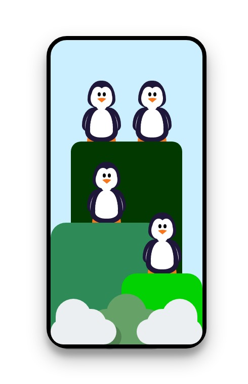
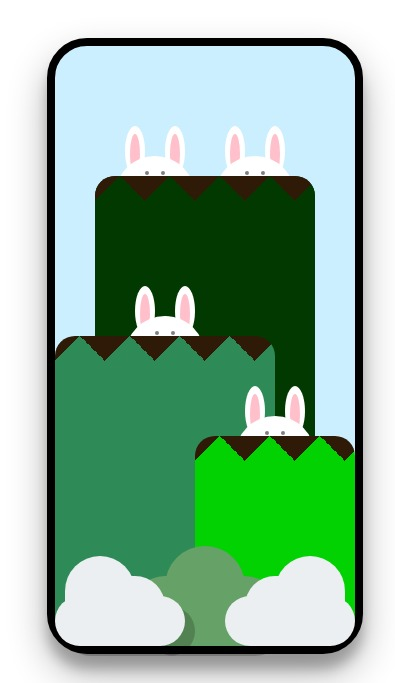

:boom: HTML &amp;&amp; CSS

  <h3>Layout of the design with Penguin:octocat:</h3>
  

  <h3>Layout of the design with Bunny :octocat:</h3>
  

### 
 Show some ❤️ by starring some of the repositories! 
